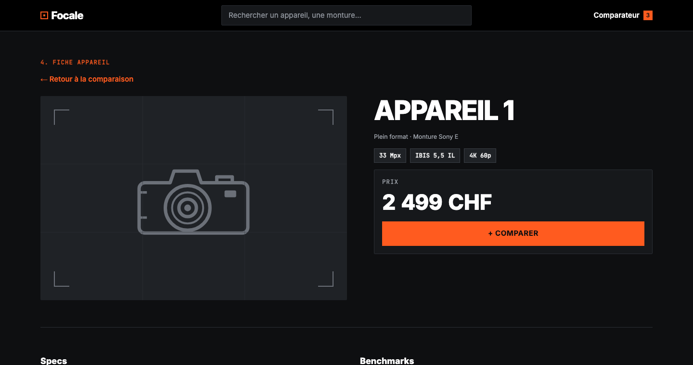
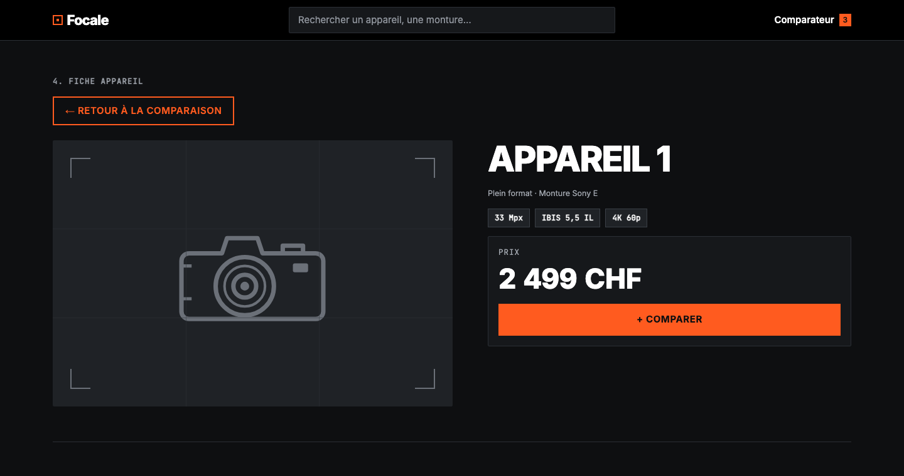

# Tests utilisateurs & fiche d'observation

La maquette est statique : on ne teste pas la réussite du parcours complet (prévue en s16 sur l'app en ligne). On teste **la compréhension** (test 5 secondes) et **la localisation des contrôles** (« montrez où vous cliqueriez »).

## Fiche d'observation

**App testée** : Focale, maquette retenue (piste C — Moderne & Pragmatique), [`propositions/`](propositions/)
**Testeur** : Axelle Goedecke
**Observateur** : Florian Lovis
**Date** : 09 octobre 2026
**Tâche donnée** : « Vous voulez comparer trois appareils plein format, puis voir la fiche détaillée de l'un d'eux. »

### Test 5 secondes

Montrer la page [Résultats](propositions/2-resultats.html) pendant 5 secondes, puis la cacher et demander : « C'est une appli pour… ? »

- Phrase du testeur : « Comparer des appareil photo ? »
- Écart avec l'intention (*comparer en détail les specs de plusieurs appareils photo*) : Réponse de la testeuse satisfaisante

### Test de localisation (sur image)

Une consigne par écran. Le testeur **montre du doigt** où il cliquerait, sans cliquer. L'observateur ne dit rien.

| Écran | Consigne dite : « Montrez où vous cliqueriez pour… » | Bon contrôle attendu | Bon contrôle ? (oui / non / à côté) | Hésitation | Dit à voix haute |
|---|---|---|:-:|---|---|
| [1. Filtres](propositions/1-filtres.html) | « … ne garder que les appareils plein format » | case « Plein format » | Oui | Non | Non |
| [2. Résultats](propositions/2-resultats.html) | « … comparer les appareils sélectionnés » | bouton « Comparer (3) » | Oui| Non| Oui |
| [3. Comparaison](propositions/3-comparaison.html) | « … voir le détail de l'Appareil 2 » | lien « Voir la fiche → » | Oui| Non| Non |
| [4. Fiche](propositions/4-fiche-appareil.html) | « … revenir au tableau de comparaison » | lien « ← Retour à la comparaison » | Oui| Oui| Non |

**J'ai aidé** : non

**Bilan** : la testeuse a compris le but de l'app en 5 secondes et a trouvé le bon contrôle sur les 4 écrans, sans aide. **Une seule hésitation** : sur la fiche appareil, avant de trouver le lien « ← Retour à la comparaison ».

## Contraste du bouton principal

| Élément | Texte | Fond | Ratio mesuré (WebAIM) | AA |
|---|---|---|:-:|:-:|
| Bouton « Comparer (3) » / « Voir les résultats » (piste C) | `#0E0F11` | `#FF5B1F` | [6,18:1](https://webaim.org/resources/contrastchecker/?fcolor=0E0F11&bcolor=FF5B1F) | ✅ |

Détail de toutes les mesures : [contrastes.md](contrastes.md).

## 2 correctifs prioritaires déduits du test

1. **Problème observé (test)** : hésitation sur l'écran 4 avant de trouver « ← Retour à la comparaison ». Dans la maquette, ce lien est un petit texte orange placé juste sous l'étiquette « 4. FICHE APPAREIL », elle aussi orange mais non cliquable : les deux se confondent. → **Correctif** : transformer le lien retour en bouton secondaire encadré, et passer les étiquettes d'écran en gris (`#A2A7AF`) pour que l'orange signale uniquement ce qui est cliquable. *(Appliqué, voir l'itération ci-dessous.)*
2. **Problème relevé (critique, non observé pendant le test)** : le test n'a révélé qu'une seule friction. Le second correctif vient donc de la [critique](critique.md) : le petit texte de la piste C fait 12,5 px (monture, compteur de sélection), ce qui est fatigant à lire. → **Correctif** : passer `--fs-small` de 12,5 px à 14 px et `--fs-body` de 15 px à 17 px. *(Prévu.)*

## Itération : 1 changement (avant / après)

| | Capture | Description |
|---|---|---|
| **Avant** |  | Lien retour en petit texte orange, collé à l'étiquette d'écran orange : on ne distingue pas ce qui est cliquable. |
| **Après** |  | Lien retour en bouton secondaire encadré d'orange (2 px), en majuscules comme les autres boutons ; étiquette d'écran en gris. Seuls les éléments cliquables restent orange. |

**Modification faite dans le code** : [`propositions/css/piste-c-moderne.css`](propositions/css/piste-c-moderne.css)

- variable `--label-text` : `#FF5B1F` → `#A2A7AF` (contraste sur le fond : [7,93:1](https://webaim.org/resources/contrastchecker/?fcolor=A2A7AF&bcolor=0E0F11)) ;
- nouvelle règle `.back-link` : bordure `2px solid var(--color-accent)`, `padding: 10px 18px`, survol rempli d'orange.

Le changement s'applique aussi aux liens retour des écrans 2 et 3, pour garder la cohérence. **À vérifier** : refaire le test de localisation de l'écran 4 avec une autre personne.
